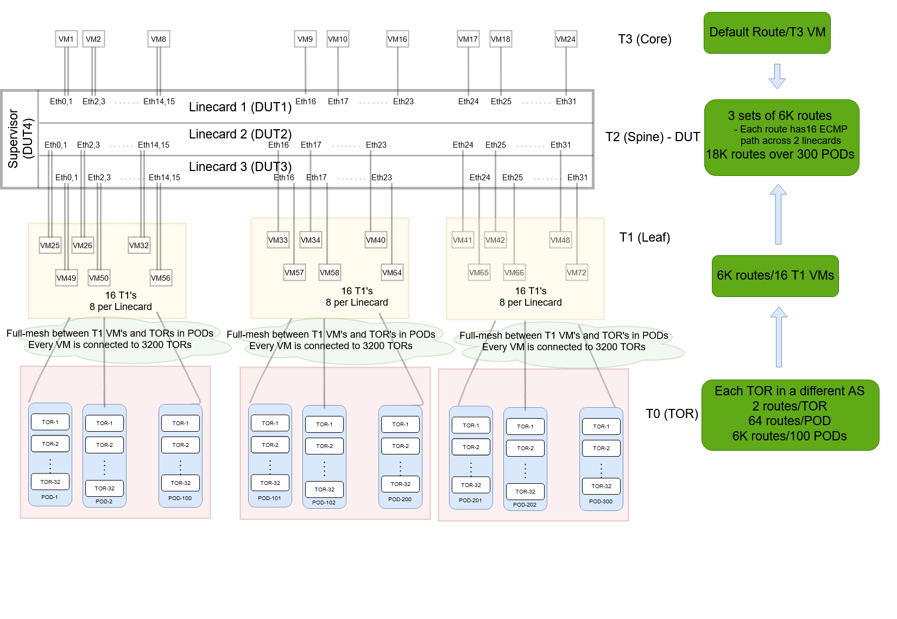

# Announcing routes to a T2 VOQ Chassis
# High Level Document

Table of Contents

  - [Revision](#revision)

  - [About this Manual](#about-this-manual)

  - [Scope](#scope)

  - [Requirements](#requirements)
  
  - [Approach](#approach)

   
###### Revision
| Rev |     Date    |       Author                                                                       | Change Description                |
|:---:|:-----------:|:----------------------------------------------------------------------------------:|-----------------------------------|
| 1.0 | 2/7/2021    | Nokia Sonic Team                                                                   | Initial  version                  |

# About this Manual
This document describes how routes from T1 and T3 VM's are announced to a T2 VOQ SONiC Chassis in the sonic-mgmt OC tests.

# Scope
The T2 topology for a VOQ Chassis is defined in [topologies supported] (https://github.com/Azure/sonic-mgmt/blob/master/docs/testbed/README.testbed.Topology.md) for the current SONiC OC tests in sonic-mgmt. It has 3 linecards, with one linecard connecting to uplink 24 T3 VM's, and 2 linecards that are connected to 24 T1 VM's each. 

The scope of this document is to define the how routes from these VM's are announced to a T2 chassis, simulating a typical data center network architecture. This route distribution will be added to test_announce_routes.py in the sonic-mgmt OC tests.

# Requirements
The following are requirements with regards to route distribution and scaling for testing a T2 chassis in the OC sonic-mgmt tests:
- 18K total routes in the chassis routing table.
- Each downlink (towards T1 DUTs) route has 16 ECMP paths distributed equally across 2 linecards 
   - This allows for ECMP across the fabric.
- Default route is towards the T3 VM's.

# Approach
In sonic-mgmt OC tests, the number of routes announced into a Device Under Test (DUT) is controlled using the following knobs:
- number of routes per TOR
- number of TOR's per POD
- number of PODs in the topology.

In order to achieve 18K routes, we use the following numbers:
- 2 routes per TOR
- 32 TOR's per POD => 64 routes per POD
- 300 PODs in the topology => 64 * 300 = 18K routes in the network.

The diagram below shows the details of how these TORs/PODs are connected via T1 VM's to a T2 chassis under test. 

The T2 chassis (DUT) has 3 linecards:
- Linecard1 is the uplink linecard and is connected to 24 T3 VM's - 8 are 2 port LAG's, and 16 are single port non-LAG VM's.
- Linecard2 is the downlink linecard and is connected to 24 T1 VM's - 8 are 2 port LAG's, and 16 are single port non-LAG VM's.
- Linecard3 is the downlink linecard and is connected to 24 T1 VM's - 8 are 2 port LAG's, and 16 are single port non-LAG VM's.

For distributing the 18K routes across the T1 VM's, we divide the 18K routes from the TOR's into 3 sets of 6K routes. 
 - Each set of routes come from 100 PODS => 3 set of 100 PODs each
 - Each set of PODs is connected to 8 T1 VM's on Linecard2, and 8 T1 VM's on Linecard3.
   - Every T1 VM is has routes from all the 3200 VM's in a set of 100 PODs => 6400 routes from TOR's.
   - Gives us 16 ECMP paths across 2 linecards through the chassis.

Following shows a route from a TOR (192.168.0.0/25) on the 3 linecards:
- Linecard1: 2 ECMP paths across the fabric port (Inband0) to the 2 other linecards that connect to T1 VM's
<pre>
admin@board1:~$ show ip route 19.168.0.0
Routing entry for 192.168.0.0/25
  Known via "bgp", distance 200, metric 0, best
  Last update 00:29:50 ago
    10.0.0.65 (recursive), weight 1
  *   10.0.0.65, via Inband0 onlink, weight 1
    10.0.0.161 (recursive), weight 1
  *   10.0.0.161, via Inband0 onlink, weight 1
</pre>

- Linecard2: 8 ECMP paths across a set of 8 T1 VM's
<pre>
admin@board2:~$ show ip route 19.168.0.0
Routing entry for 192.168.0.0/25
  Known via "bgp", distance 20, metric 0, best
  Last update 00:29:51 ago
  * 10.0.0.65, via PortChannel0001, weight 1
  * 10.0.0.69, via PortChannel0003, weight 1
  * 10.0.0.73, via PortChannel0005, weight 1
  * 10.0.0.77, via PortChannel0007, weight 1
  * 10.0.0.81, via PortChannel0009, weight 1
  * 10.0.0.85, via PortChannel0011, weight 1
  * 10.0.0.89, via PortChannel0013, weight 1
  * 10.0.0.93, via PortChannel0015, weight 1
</pre>
- Linecard3: 8 ECMP paths across a set of 8 T1 VM's
<pre>
admin@board3:~$ show ip route 19.168.0.0
Routing entry for 192.168.0.0/25
  Known via "bgp", distance 20, metric 0, best
  Last update 00:29:49 ago
  * 10.0.0.137, PortChannel0050, weight 1
  * 10.0.0.141, PortChannel0050, weight 1
  * 10.0.0.145, PortChannel0051, weight 1
  * 10.0.0.149, PortChannel0052, weight 1
  * 10.0.0.153, PortChannel0053, weight 1
  * 10.0.0.157, PortChannel0054, weight 1
  * 10.0.0.161, Ethernet16, weight 1
  * 10.0.0.163, Ethernet17, weight 1
</pre>

The following shows the default route on all the 3 linecards:
- Linecard1 - 24 ECMP paths to the 24 T3 VM's connected to it.
<pre>
admin@board1:~$ show ip route 0.0.0.0
Routing entry for 0.0.0.0/0
  Known via "bgp", distance 20, metric 0
  Last update 00:45:14 ago
    * 10.0.0.1, via PortChannel0002, weight 1
    * 10.0.0.5, via PortChannel0004, weight 1
    * 10.0.0.9, via PortChannel0006, weight 1
    * 10.0.0.13, via PortChannel0008, weight 1
    * 10.0.0.17, via PortChannel0010, weight 1
    * 10.0.0.21, via PortChannel0012, weight 1
    * 10.0.0.25, via PortChannel0014, weight 1
    * 10.0.0.29, via PortChannel0016, weight 1
    * 10.0.0.33, via Ethernet16, weight 1
    * 10.0.0.35, via Ethernet17, weight 1
    * 10.0.0.37, via Ethernet18, weight 1
    * 10.0.0.39, via Ethernet19, weight 1
    * 10.0.0.41, via Ethernet20, weight 1
    * 10.0.0.43, via Ethernet21, weight 1
    * 10.0.0.45, via Ethernet22, weight 1
    * 10.0.0.47, via Ethernet23, weight 1
    * 10.0.0.49, via Ethernet24, weight 1
    * 10.0.0.51, via Ethernet25, weight 1
    * 10.0.0.53, via Ethernet26, weight 1
    * 10.0.0.55, via Ethernet27, weight 1
    * 10.0.0.57, via Ethernet28, weight 1
    * 10.0.0.59, via Ethernet29, weight 1
    * 10.0.0.61, via Ethernet30, weight 1
    * 10.0.0.63, via Ethernet31, weight 1
</pre>

- Linecard2 - single route across the fabric port (Inband0) to the Linecard1 connected to T3 VM's
<pre>
admin@board2:~$ show ip route 0.0.0.0
Routing entry for 0.0.0.0/0
  Known via "bgp", distance 200, metric 0, best
  Last update 00:13:10 ago
    10.0.0.35 (recursive), weight 1
  *   10.0.0.35, via Inband0 onlink, weight 1
</pre>

- Linecard3 - single route across the fabric port (Inband0) to the Linecard1 connected to T3 VM's
<pre>
admin@board3:~$ show ip route 0.0.0.0
Routing entry for 0.0.0.0/0
  Known via "bgp", distance 200, metric 0, best
  Last update 00:13:10 ago
    10.0.0.13 (recursive), weight 1
  *   10.0.0.13, via Inband0 onlink, weight 1
</pre>

